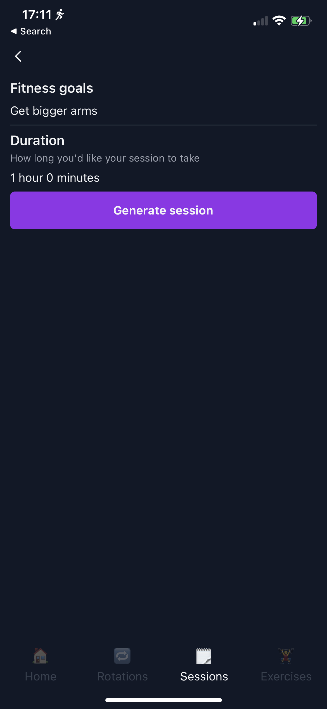

import { StrydeDownloadBanner } from '../src/components/StrydeDownloadBanner';

This project was pretty much born out of some serious FOMO caused by all the hype currently surrounding ChatGPT/GPT-3. One of the features that's been lacking from [Stryde](https://apps.apple.com/us/app/stryde-workout-planner/id1640276342) is a preset list of exercises or workouts that users can choose from, but I thought it'd be cool to go one step further and generate these based on the user's needs. While I have some experience with ML, it's limited to some pretty basic neural networks and something like this is beyond my capabilities for now. It seemed that using OpenAI's GPT-3 API could be a good way to solve this, and scratch my AI itch.

<div className="max-w-full sm:max-w-md m-auto mb-2">

</div>

<StrydeDownloadBanner />

## Playing with GPT-3
OpenAI have a really useful GPT-3 playground, where you can try out different prompts and see what it spits out. I'd seen a few Tweets where people had managed to get it to respond reliably in a certain format like CSV or JSON. It took a little bit of tweaking but I ended up with the below prompt
```
Generate a workout that takes around 30 minutes for someone with the below goals:
Improve the size of my arms

Don't repeat exercises. Each exercise should be formed of a number of sets and can include a weight. Sets can either be formed of repetitions or a number of seconds. Number of sets and reps should be varied and appropriate for the exercise. Your response should be in valid JSON format with the response on one line. Here is an example:
[{ "name": "Squat", "sets": 5, "reps": 5, "weight": 50 }, { "name": "Sprint", "sets": 10, "time": 30 }]
```

I found that anything other than Davinci (OpenAI's most powerful and expensive version of GPT-3) struggled with this, but after tweaking some settings I was getting responses like this
```json
[{ "name": "Barbell Curl", "sets": 3, "reps": 8, "weight": 20 }, { "name": "Tricep Extension", "sets": 3, "reps": 10, "weight": 10 }, { "name": "Barbell Overhead Press", "sets": 3, "reps": 10, "weight": 20 }, { "name": "Cable Rope Hammer Curl", "sets": 3, "reps": 10, "weight": 10 }, { "name": "Pull-Ups", "sets": 3, "reps": 8 }, { "name": "High Plank", "sets": 3, "time": 30 }, { "name": "Wall Push-Ups", "sets": 3, "reps": 10 }]
```
Looks pretty good to me!

## Setting up an API
Before building this project, Stryde had no backend at all because it didn't really need one. I toyed with the idea of hitting OpenAI's API directly from the device, but that would require me to ship the app with my API keys which common sense and previous experience told me might not be the best idea.

While this would have been a fun opportunity to play with Kubernetes or Elastic Beanstalk, that really would have been overkill and so I decided to run with a serverless solution. I've played with the [Serverless framework](serverless.com) before and decided to give it a go.

I won't run through the set up of the Framework here (it's pretty simple), but will share bits of my config and the code for the Lambda function itself.

My `serverless.yaml` has a single function in it, plus a few other standard bits of config that I shall leave out
```yaml
functions:
  generateWorkout:
    handler: handler.generateWorkout
    timeout: 20
    events:
      - httpApi:
          path: /generate-workout
          method: post
```

I needed a pretty long timeout as OpenAI's completion API isn't the quickest. Here's the contents of my handler file
```typescript
import { APIGatewayProxyHandler } from 'aws-lambda';
import { Configuration, OpenAIApi } from 'openai';

const OPENAPI_KEY = process.env.OPENAPI_KEY;

const openApiConfig = new Configuration({
  apiKey: OPENAPI_KEY,
})
const openai = new OpenAIApi(openApiConfig);

export const generateWorkout: APIGatewayProxyHandler = async (event) => {
  if (!event.body) {
    return {
      statusCode: 500,
      body: 'No event body received',
    };
  }

  const { goals, time } = JSON.parse(event.body);

  if (!goals || !time) {
    return {
      statusCode: 500,
      body: 'Invalid event body',
    };
  }

  const prompt = `
    Generate a workout that takes around ${time} minutes for someone with the below goals:
    ${goals}
    
    Don't repeat exercises. Each exercise should be formed of a number of sets and can include a weight. Sets can either be formed of repetitions or a number of seconds. Number of sets and reps should be varied and appropriate for the exercise. Your response should be in valid JSON format with the response on one line. Here is an example:
    [{ "name": "Squat", "sets": 5, "reps": 5, "weight": 50 }, { "name": "Sprint", "sets": 10, "time": 30 }]
  `;

  const response = await openai.createCompletion({
    model: "text-davinci-003",
    prompt,
    temperature: 0.8,
    max_tokens: 256,
  });
  
  const text = response.data.choices[0]?.text;

  if (!text) {
    return {
      statusCode: 500,
      body: 'Invalid response',
    };
  }

  try {
    JSON.parse(text);
  
    return {
      statusCode: 200,
      body: text,
    };
  } catch (e) {
    return {
      statusCode: 500,
      body: 'Invalid JSON response',
    };
  }
};
```

This is probably largely self explanatory. I read the requested `time` and `goals`, pass them in to the prompt and then hit OpenAI. I check the response is valid JSON, and if it is I then respond. I configured the environment variables in the serverless config like this
```yaml
custom:
  secrets: ${file(./secrets.json)}

provider:
  environment:
    OPENAPI_KEY: ${self:custom.secrets.${sls:stage}.OPENAPI_KEY}
```

where `secrets.json` looks like this
```json
{
  "dev": {
    "OPENAPI_KEY": "..."
  },
  "production": {
    "OPENAPI_KEY": "..."
  }
}
```

You can deploy this straight away and it'll work fine, but I used `serverless-domain-manager` to have my production API Gateway sit behind a custom domain.

## Adding the API to Stryde
Setting up the UI on Stryde, plus making a request to the API and processing the response was probably the most complicated part of this whole process. All Stryde users will get a single workout for free, and will then need to purchase them for 99p (or the local equivalent) through an in app purchase.

I used the `react-native-iap` library for this, which makes the complicated process of adding in app purchases to your app relatively simple. Testing them out with either a StoreKit config file or using the App Store sandbox isn't particularly easy and probably justifies a post all of it's own!

<StrydeDownloadBanner />