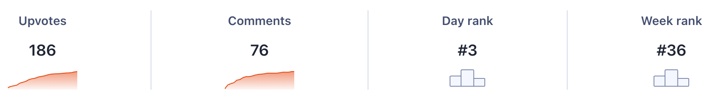
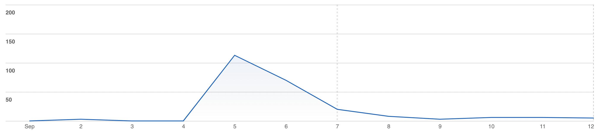
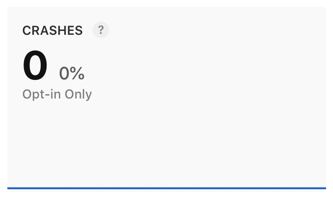

Stryde is my fitness planner workout, written in React Native and built with Fastlane. While it's not currently monetised in any way, I thought it'd be cool to share it on Product Hunt and get some feedback on it. Below I'll discuss my experience and run through some numbers.

## Pre-launch
There are tonnes of Product Hunt launch checklists out there, which will tell you to collect emails, post on Twitter about your launch, alert your friends and family, and so on. I did exactly none of this.

I uploaded the same screenshots I use on Stryde's App Store page and used the same description. In fact, the only new piece of content I had to create was an initial comment for the post.
> Hey PH! Thrilled to be launching Stryde here today 🚀
>
> After years of using a note on my phone to keep track of my gym sessions, I'd had enough. I decided to look around for an app that would do what I needed, but unfortunately nothing seemed to quite do it. Some got close but required in app purchases to add custom exercises or customise it to the level I needed.
>
> I decided to build my own solution. I've been using Stryde myself for about a month now and I'm loving it. Having the app time my rests for me means no more staring at the clock, and I no longer lose track of how many sets I've done 😅
>
> The app is totally free with no ads or in app purchases. Please give it a go and let me know what you think, I hope you like it!

Not particularly groundbreaking!

I submitted the post on a Wednesday and scheduled it for launch the following Monday, at midnight PST. This gives you the maximum amount of time for your post to be live.

At some point after I submitted it, the post was picked to be featured meaning it was in the default view when you visit Product Hunt, not under the "Newest" filter.

## Launch day
I wasn't expecting big things from the launch, and so I was pretty surprised when I started getting emails from Product Hunt (while at the gym funnily enough!) telling me people were commenting on the post. I had a look and I was at #3!

I checked the comments every so often for the rest of the day, being sure to reply to everyone. The post stayed at #3 and that's where it finished!

There's not really much more to add on the launch day experience. It was pretty overwhelming to get such a great reaction to something I'd made to solve a problem I had!

## The numbers

I actually finished the day on 169 upvotes, but I still seem to be getting a few every day. Some of the comments had some really helpful feedback, and a lot of people asking about an Android version.

I ended up having 113 downloads on launch day, 70 the day after than, 20 two days after and since then it's bounced about between 8 and 3 every day. I'm not sure if the continuing trickle of downloads is due to Product Hunt, or if I'm getting some organic traffic through the App Store search.

This is probably the metric I'm most pleased with though:

## What's next?
I'm continuing to add new features to Stryde, but in terms of driving downloads it's tough to know what to do now. I'm considering launching on Beta List, but beyond that it looks like it'll be difficult without doing proper marketing. Given this is just a pet project and doesn't make a penny at the moment, I'm not sure I'll bother!