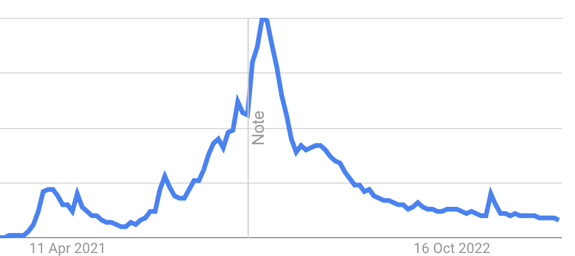
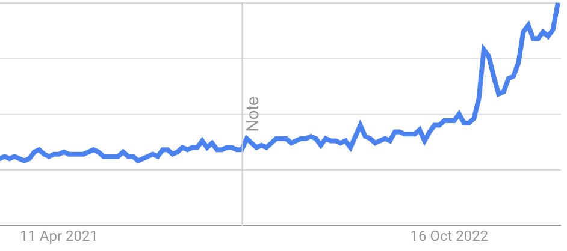

I think like most people working in or around Software Engineering, the introduction of LLMs like GPT has got me questioning what the future looks like for my profession, or if there even is one. Throughout my hours of doom scrolling I've seen a few distinct schools of thought that are emerging, and I'd like to jot down my thoughts on each.

This is by no means an exhaustive list of the potential outcomes, and no doubt the future will be way more nuanced than what I can write here, but it's a start.

## "This is all hype"
Whenever I see this touted online, it almost always includes parallels being drawn between AI and web3/crypto. I think this misses one really quite important distinction, which is that AI is already providing tangible utility and improvements in productivity. This is pretty hard to argue with - even with a few years of experience under my belt I still use Google daily, now I can just ask ChatGPT which takes far less time and provides me with the code I need. Despite the fact the technologies behind web3/crypto are incredibly interesting, I don't think we've really seen much from that ecosystem yet that provides real utility.

The web3 hype cycle is pretty plain to see, just have a look at the below Google search trends for "nft" between January 2021 and March 2023.

Conversely, the same period for "AI" shows an upward trajectory with no signs of slowing down. Admittedly, if I'd done the same for "nft" in the summer of 2021 it would have shown the same, but I think it's plain to see that AI is here to stay and that it's going to change the way we work forever.

In my mind, the "AI hype" theory has been totally debunked.

## "AI will just make us better engineers"
I think this and the below are really part of the same outcome, but the below is a natural conclusion which I think most engineers aren't yet thinking about. As I've made clear above, I already think that the current crop of LLMs is enough to make us better engineers. It's important to make clear here that by "better", what I really mean is "more efficient". I'm of the opinion that the best engineers understand the how and why of what they're doing, and don't just blindly copy and paste code that gives them the right results. However, writing the same boilerplate over and over again is an obvious waste of time. We've been abstracting this away in different ways for years, LLMs are just the latest.

Tools like ChatGPT are nowhere near being able to build complex systems like we're used to working on day to day. This is where the real value of a software engineer lies and I can't see any of the existing models or architectures changing this.

## "We don't need as many engineers anymore"
As noted above, this is just the natural conclusion of AI making us more efficient engineers. If we're able to do 10% more work, we now need 10% fewer engineers. This, combined with the massive layoffs we're seeing amongst big tech companies, means the supply and demand dynamic for engineers is going to change massively in the next few years.

I can see Computer Science being a far less popular option for students going forwards, and I think the number of junior engineering roles available is going to fall hugely. Ultimately, salaries will reduce, and only the best engineers will be able to secure the remaining jobs.

## "We don't need any engineers anymore"
I touched on this above, but I don't think this is realistic. The information required for anyone to start coding and build their own company has been available online for decades. Tools like ChatGPT are just a new interface to access that information.

Granted, it's a much more natural way to find what you're looking for, and I've no doubt that it's possible to learn how to be an engineer through GPT alone. The barrier to entry is now lower, but it's always been possible.

## "We're close to AGI"
This one is...interesting.

I think people saying this show a lack of understanding (or maybe just interest) in how models like GPT work. They are effectively just very impressive word predictors. You pass them the most recently predicted word, plus your input text, and it gives you a list of the next most likely words.

This isn't a new technology, but what sets the GPT tools released by OpenAI apart is the amount of data they're trained on. They've consumed a good chunk of the internet and therefore they're very capable of parrotting this information back to you. This doesn't mean that they're "thinking", nor are they capable of coming up with novel ideas on their own.

That said, I don't think that achieving AGI is necessarily that important. Afterall, what really are "intelligence" and "thinking". We don't understand enough about the human brain to really know it's inner workings, what are the chances that it's architecture is that different to the ones LLMs are built on top of?